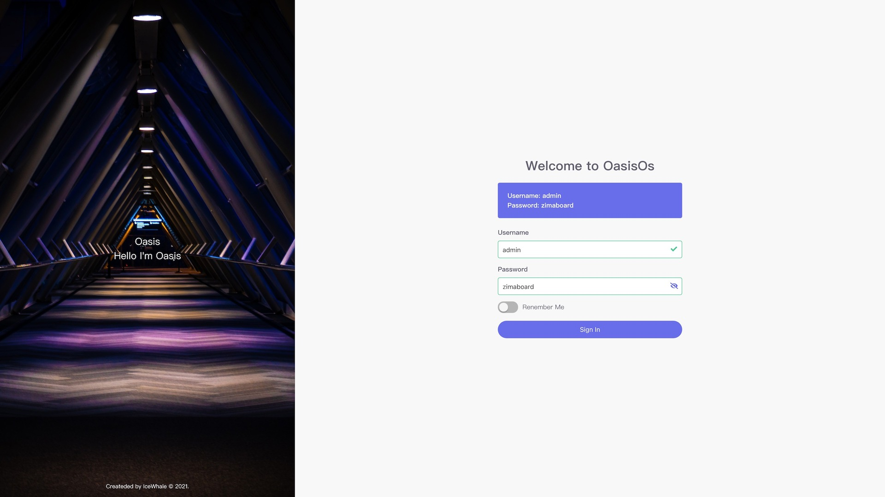
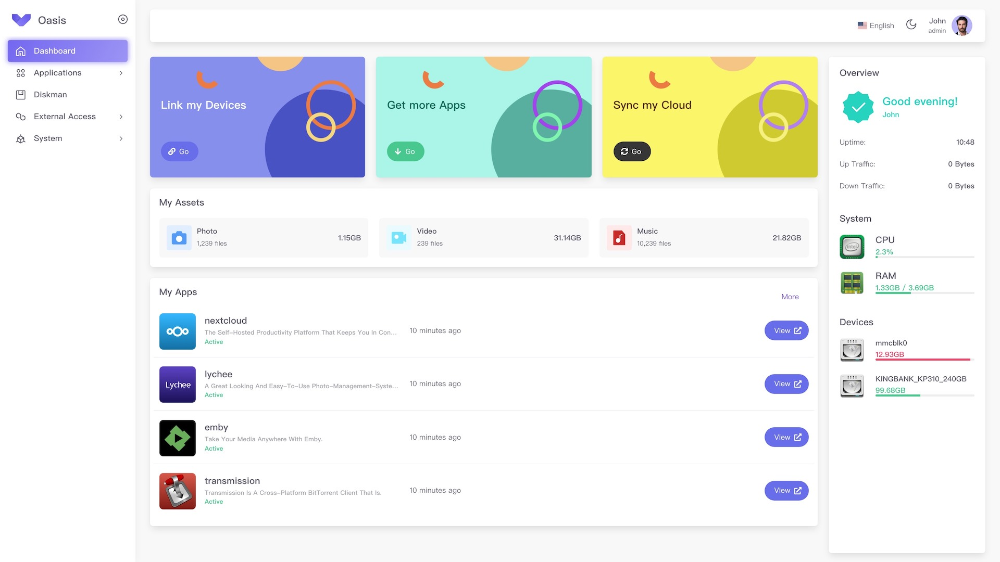
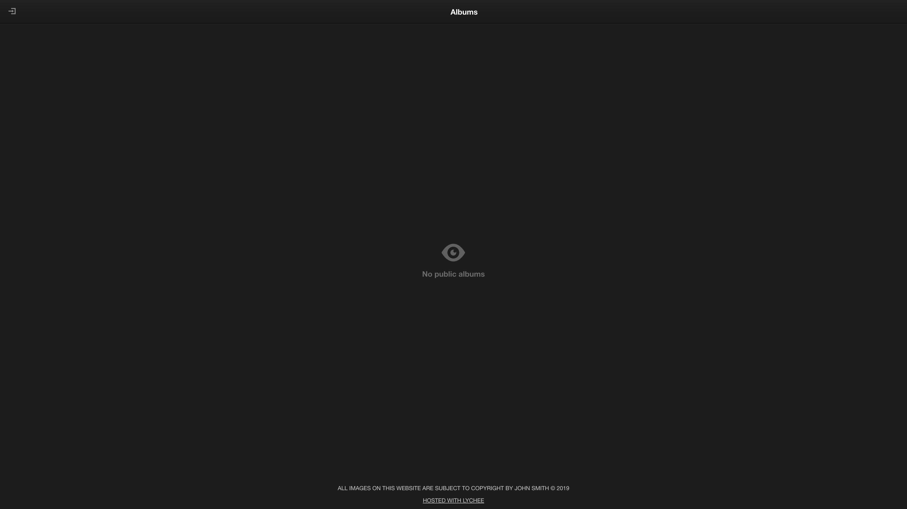
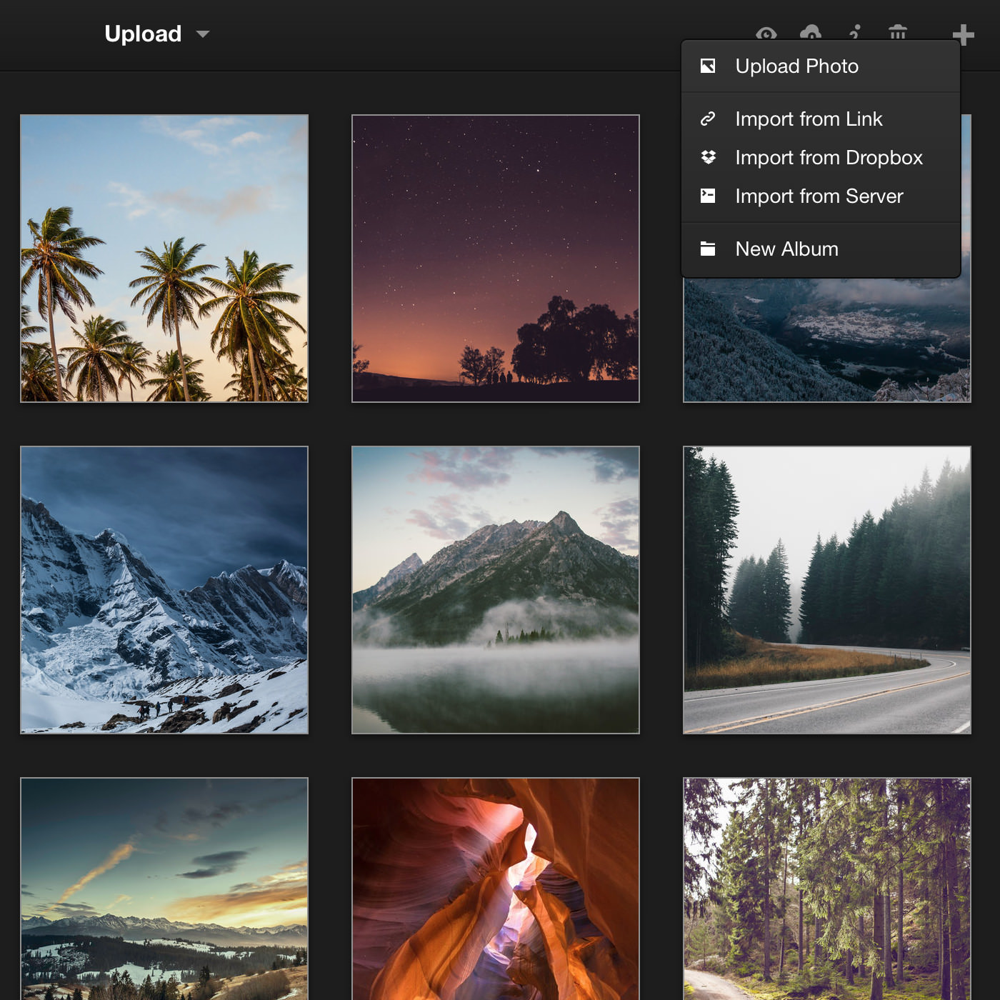
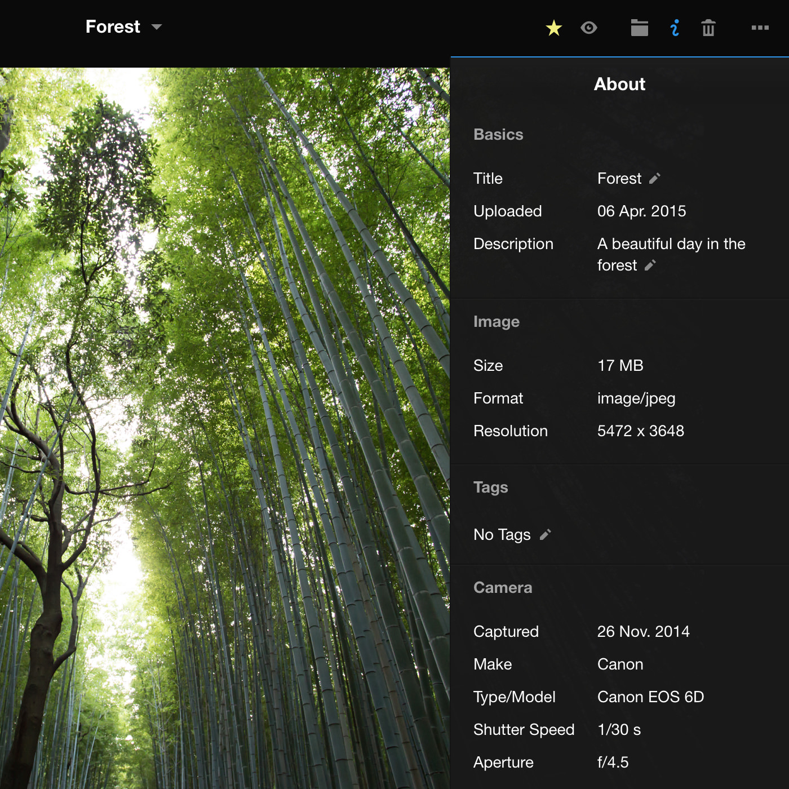
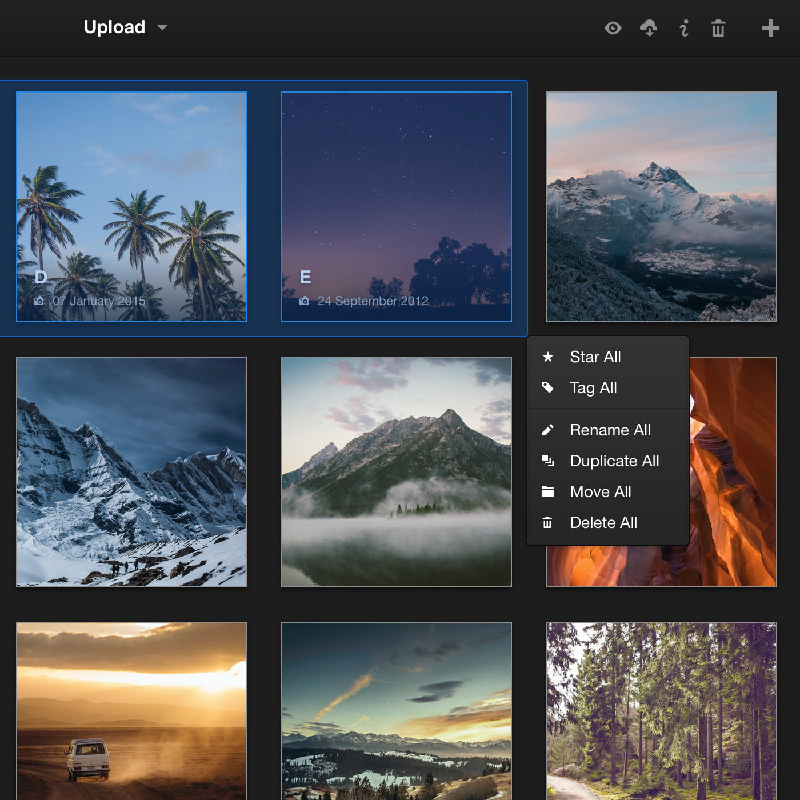

# Manage Your Photos with Lychee

## Open Lychee

Open your web browser and open `http://zimaboard.local`

(If you can't open it in Windows, try `http://zimaboard`)

Once opened, you will see the Oasis login screen: !

Enter the username `admin` and password `zimaboard` and click on "**Sign In**" to log in.

Then we are in the Oasis Dashboard.

We find **Lychee** in **My Apps** and click on its logo, and it opens

## Sign in to Lychee

After opening **Lychee** you will see a public album page, by default there is no public album, so the page is empty.

Click on the login icon  in the upper left corner to enter the login page

Enter the username `admin` and password `zimaboard`, and click **Login**

## Using Lychee

### Upload Photos or Create Albums

### View Photos Information

### Batch Editing Photos

