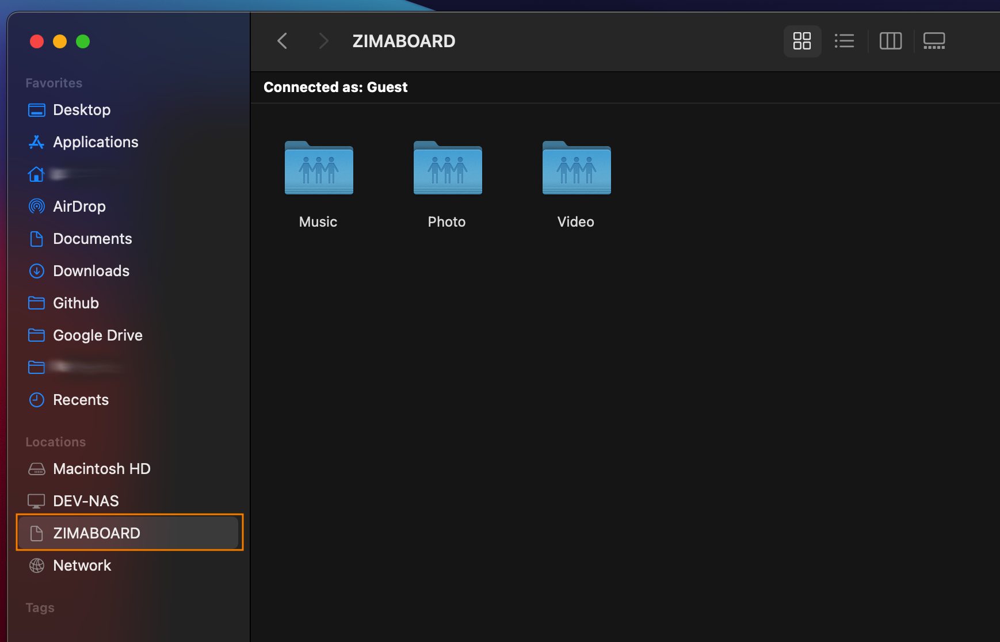
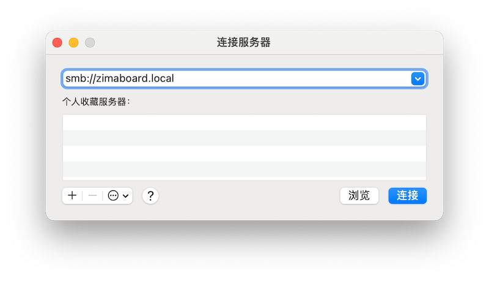
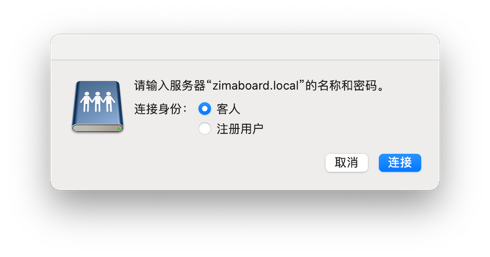
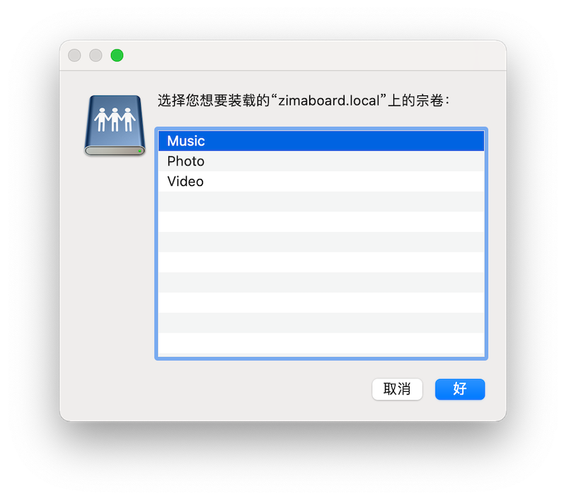
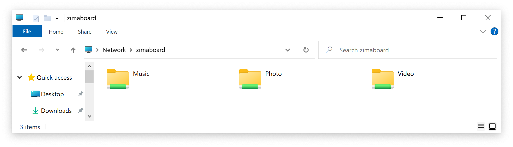
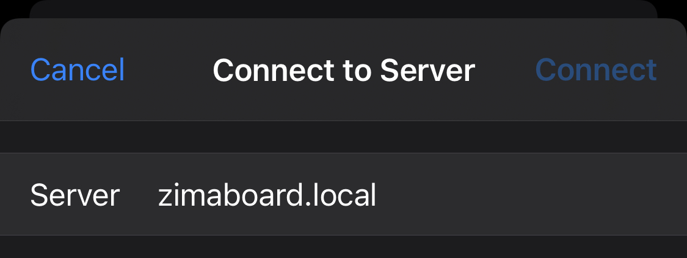
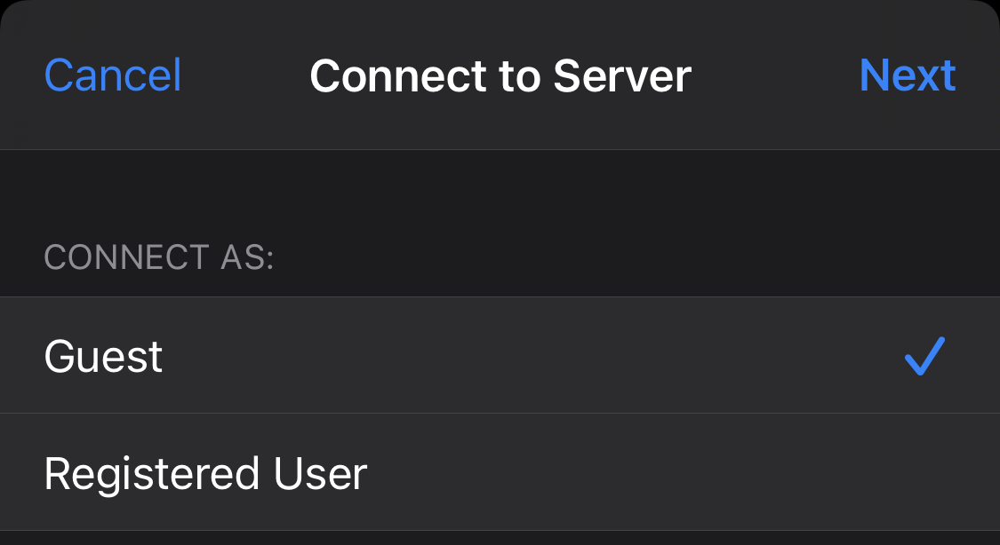
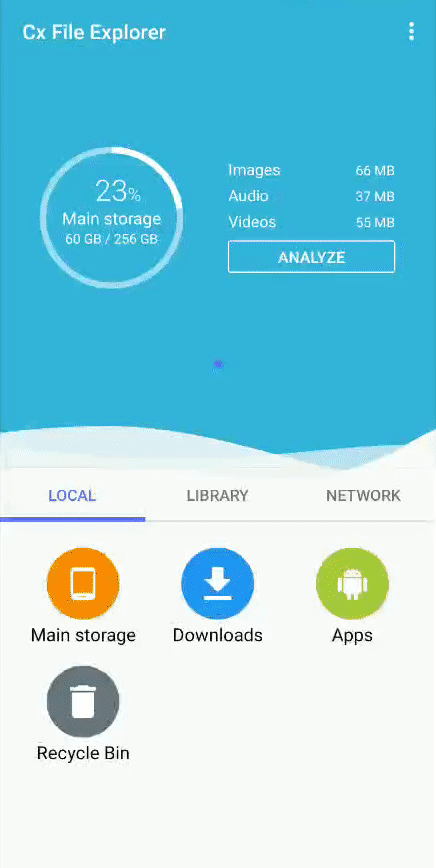
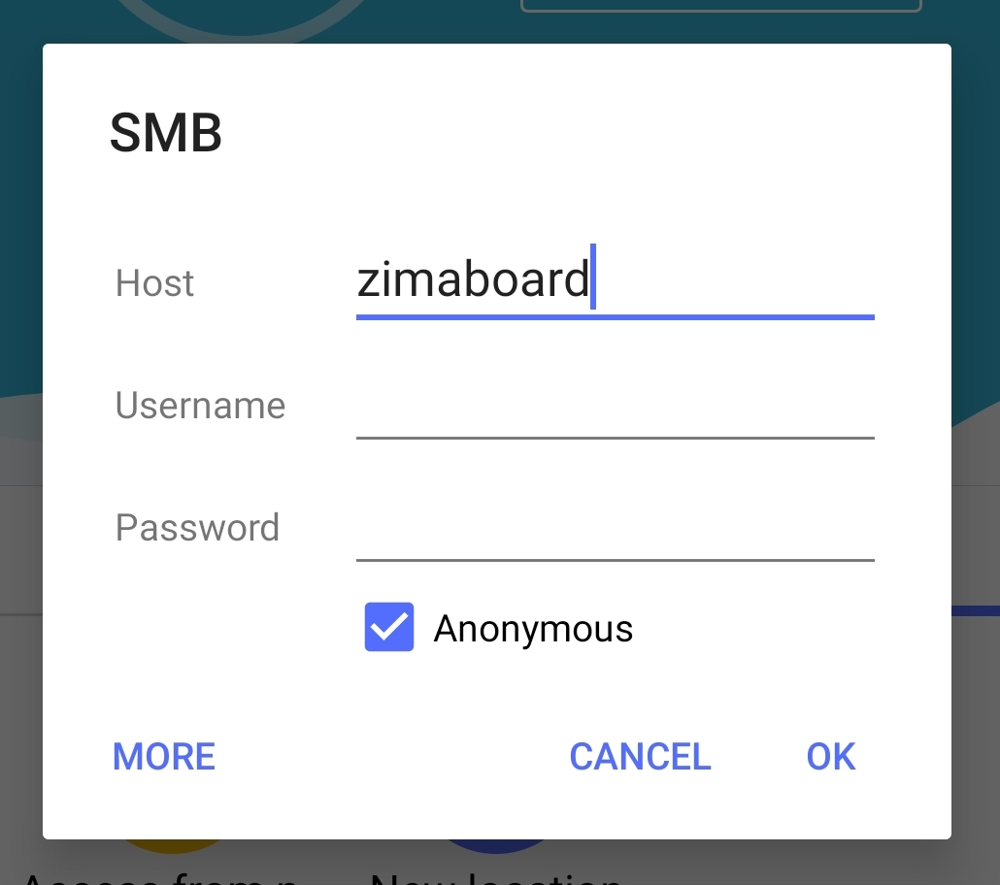
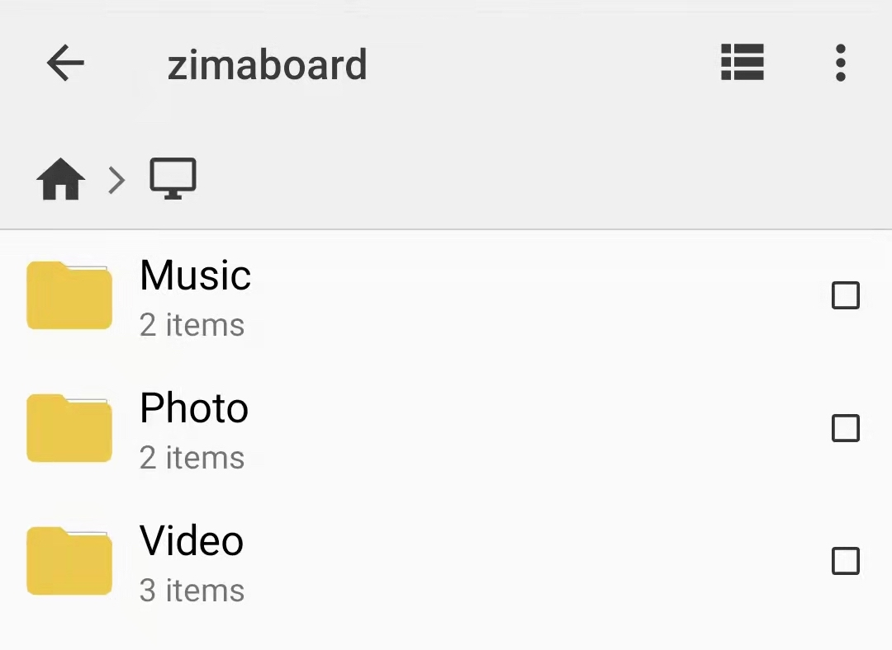

# Accessing Shared Folders

## Brief

ZimaBoard comes pre-installed with Samba, a common communication protocol for sharing files and printers over a LAN.

So, once ZimaBoard is started, the shared folders created by Samba will be automatically discovered on the LAN, whether it's your home laptop, cell phone, router, or big TV.

Of course, all the pre-made scripts are simply configuring some shared areas in the ZimaBoard file system. If you need advanced requirements, you can check **Samba extended configuration information**

## Accessing from Computers

### macOS Accessing

#### Auto-discovery of LAN disks

1. Open the **Finder**

1. Click on the device and login in guest mode to see the folders shared by ZimaBoard by default

2. Play the 4K movie from the Samba shared folders ✌. |-͡˘‿-͡˘|. ✌

:::tip

Here are the default locations of these shared folders in ZimaBoard

- Downloads: /media/Volume1/downloads
- Music: /media/Volume1/Music
- Video: /media/Volume1/Video
- Photo: /media/Volume1/Photo

You can reconfigure the shared folder path and name via /etc/samba/smb.config, refer to **Samba extended configuration information** for details
:::

#### macOS Manual Accessing

1. In the **Finder** menu, click **Go** > **Connect to Server...** 

2. Type `smb://zimaboard.local` and click on "**Connect**"

3. Select the connection identity, here we directly select "**Guest**", then click "**Connect**"

1. Select the folder you want to connect to

### Windows Accessing

1. Open **File Manager** and type \\zimaboard` in the address bar

2. Press <kbd>Enter</kbd> and you will see the shared files on your ZimaBoard

:::tip
All devices on the local network can use these shared folders as "guest".
:::

## Accessing from Phones

### iOS Accessing

1. Open the **Files** app that comes with iOS
   

2. Click the button in the upper right corner, and select "**Connect to Server**"
   

3. Enter `zimaboard.local`, or **Use router to see the IP address of ZimaBoard** (Knowledge Base Tutorial)

4. Login in with guest mode (default Samba configuration)

5. Successfully log in and access all files and media content

### Android Accessing

In Android phones, we tested several file managers (ES File Explorer, Xiaomi File Explorer, File Geek, CX File Manager, etc.).

We recommend "**CX File Manager**", which is a small, beautiful, ad-free file manager that can easily connect to many types of shared drives.

Download CX File Manager：
[Download via Google Play](https://play.google.com/store/apps/details?id=com.cxinventor.file.explorer), 
[Direct Download APK](https://www.apkmirror.com/apk/cx-file-explorer/)，

See it all in one picture:

Detailed steps

1. Open "**CX File Manager**", and select "**NETWORK**" at the bottom of the page and choose "**New Location**"

3. In the pop-up dialog box, select the "**REMOTE**" page, and select the "**SMB**" option

4. Enter `zimaboard` in the host, check the "**Anonymous**" option, and click OK.

5. You can now access the files on the shared folders!

---

At this point, I kinda want to access the files on the home server **by remote login** (corresponding to the tutorial under development...)
