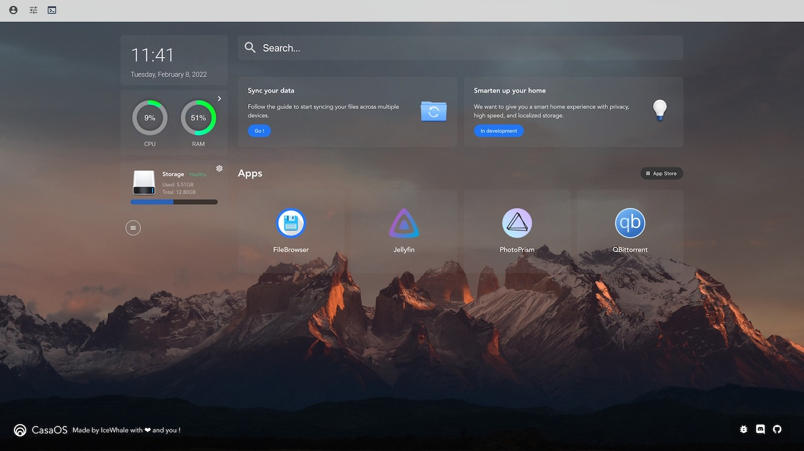

import BrowserWindow from '@site/src/components/BrowserWindow';

# Manage Your Photos with PhotoPrism

## Open PhotoPrism

Open your web browser and open **`http://casaos.local`**

(If you can't open it in Windows, try **`http://casaos`**)

<BrowserWindow url="http://casaos.local">

</BrowserWindow>

We find **PhotoPrism** in **Apps** and click on its logo, and it opens

### Login to PhotoPrism ###

:::tip

**Default account for Pre-installed Apps**

Username:`casaos`

Password:`casaos`

:::

## Using PhotoPrism

### View Photos

### View Photos Information

### Batch Editing Photos

### Create Albums

### Upload Photos 

#### Update index

See this link for more information-**https://docs.photoprism.app/**