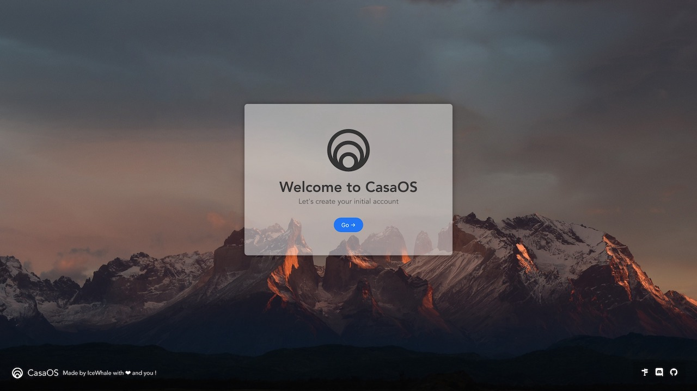
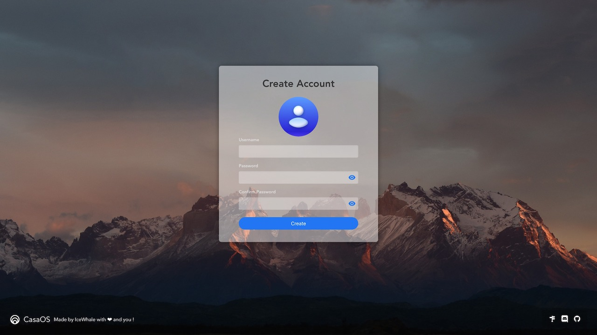

import BrowserWindow from '@site/src/components/BrowserWindow';

# Quick Start

## Preparation

- Required
  - ZimaBoard 
  - 12V/3A Power Adapter
  - Cat.5E or higher network cable
- Recommended
  - SATA Cable for ZimaBoard (Inside the ZimaBoard package)
  - 2.5" SATA SSD or HDD

:::tip

You don't need to connect your mouse and keyboard to the ZimaBoard, you can access all the services on the ZimaBoard directly through the network after connecting cables.

Of course, if you find it more convenient to plug in your monitor, you can also use a miniDP to DP or HDMI cable to connect your monitor, and connect your mouse and keyboard.

:::

## Wiring and Powering Up

### Connect Ethernet

It is recommended to connect the ZimaBoard to your router or ISP modem through a network cable, refer to this picture

:::info

If you have multiple routers in your network, make sure to connect the ZimaBoard to your primary router. Or at least to the router at the same level you use to access the device.

In short, just try to connect to the top router!

Network Details

**For example, if your network looks like this:**

The routers are connected as shown in the diagram. Both router A and router B are connected to different devices that need to be networked, and you want them both to be connected to the ZimaBoard, connect the ZimaBoard to router A.

But if all your devices that need to be networked are actually connected to router B, or if you only want the devices under router B to access the ZimaBoard, then just connect to router B.

---

**The same goes for the following network situation:**

The routers are connected as shown in the figure. Routers A, B, C and D are all connected to different Internet devices, and you want them all to connect to the ZimaBoard, connect the ZimaBoard to router A.

If you only want the devices under router B to access the ZimaBoard, then just connect to router B. At this point, none of the devices connected to routers A and C will be able to access the ZimaBoard.

:::

### Connect HDD/SSD Drive

:::tip 
This step is optional, but it is recommended that you add an external drive to use CasaOS.
:::

### Power On 

Plug in the power cable and the power indicator flashes! (ง ͡ʘ ͜ʖ ͡ʘ)ง

:::info

Please be patient for about 10-15 seconds! 

:::

## Setting Up CasaOS

:::tip
Make sure your computer is connected to the same router as the ZimaBoard
:::

### Open CasaOS

Open a new tab in your browser and enter `http://casaos.local`

<BrowserWindow minHeight={100} url="http://casaos.local">

</BrowserWindow>

### Create Your Account

<BrowserWindow url="http://casaos.local">

</BrowserWindow>

### Update CasaOS

<BrowserWindow url="http://casaos.local">

</BrowserWindow>

### Have Fun!

:::tip

**Default account for Pre-installed Apps**

Username:`casaos`

Password:`casaos`

:::

