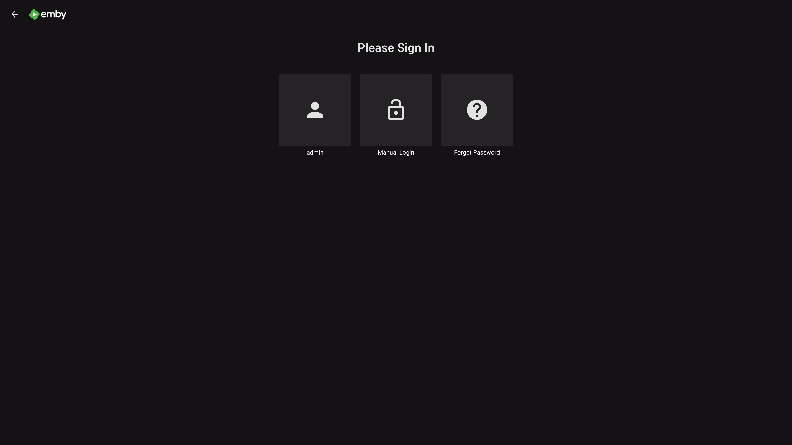
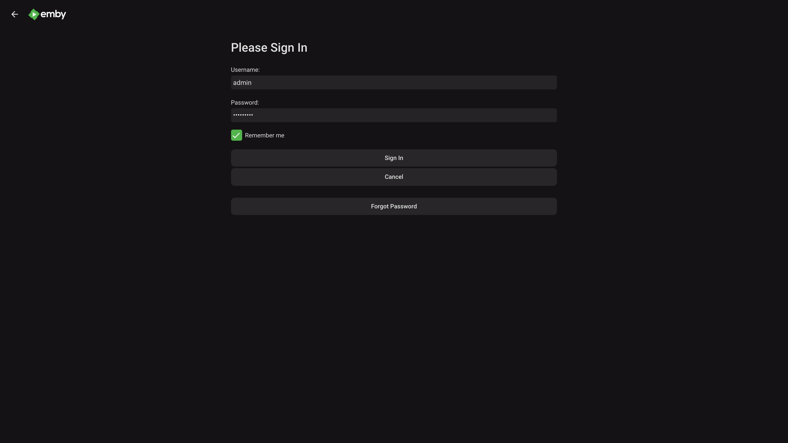
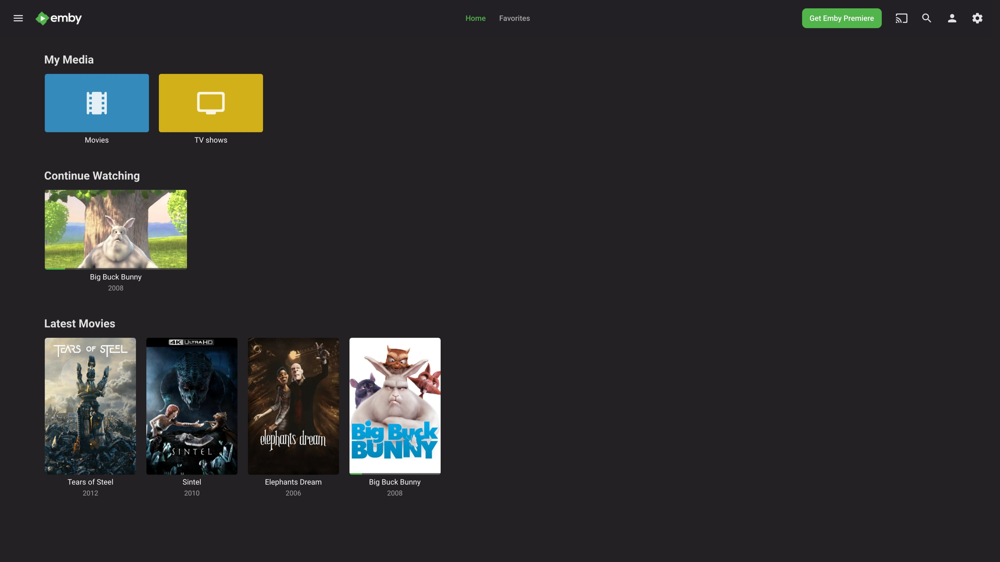
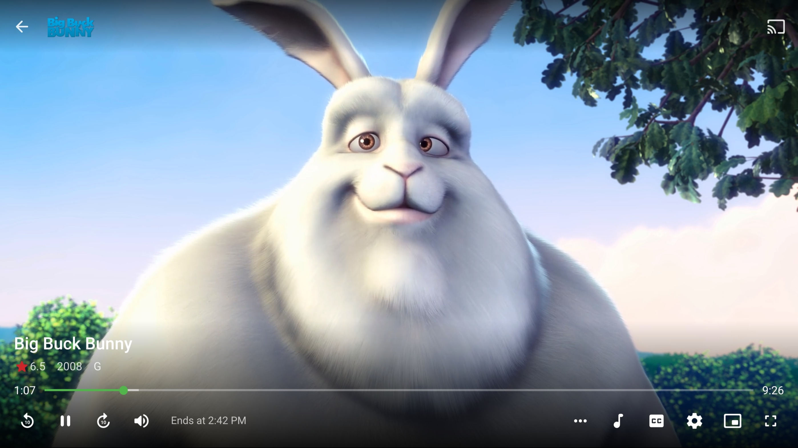
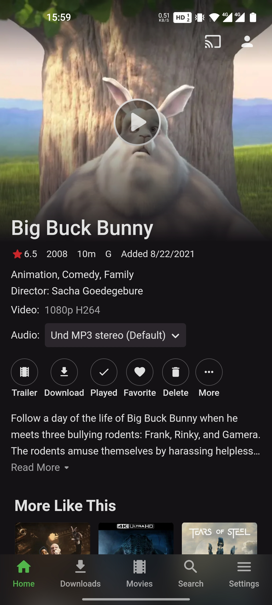
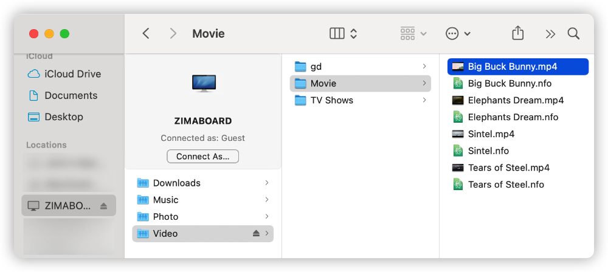

# Watching Videos Anywhere with Emby

## Open Emby

Open your web browser and open `http://zimaboard.local`

(If you can't open it in Windows, try `http://zimaboard`)

Once opened, you will see the Oasis login screen: !

Enter the username `admin` and password `zimaboard` and click on "**Sign In**" to log in.

Then we are in the Oasis Dashboard.

We find **Emby** in **My Apps** and click on its logo, and it opens

## Login to Emby

Once inside Emby, we can see the user selection screen

Select the `admin` account, enter the password `zimaboard` and click Login

Once you have logged in, we can browse the library

## Watch Videos with Emby!

Movie Information:

Playback Page:

## Watch Videos Anywhere

Emby offers a lot of ways to watch movies to choose from, you can watch them on your computer, cell phone, TV, game console, or even on VR.

**Watch videos on your phone**

**Watch videos with the browser in Oculus Quest 2**

You can see which platforms Emby offers clients for download in the "Emby Apps & Devices" section of [this link](https://emby.media/download.html)

## Adding Videos via Samba Shared Folder

We open the `Video` folder in the shared folder and you can add your own **Movies** to the `Movie` folder

Here I added a `Big Buck Bunny` to the folder

Next we can see the newly uploaded movie in Emby's media library

You can watch the Bunny now!

