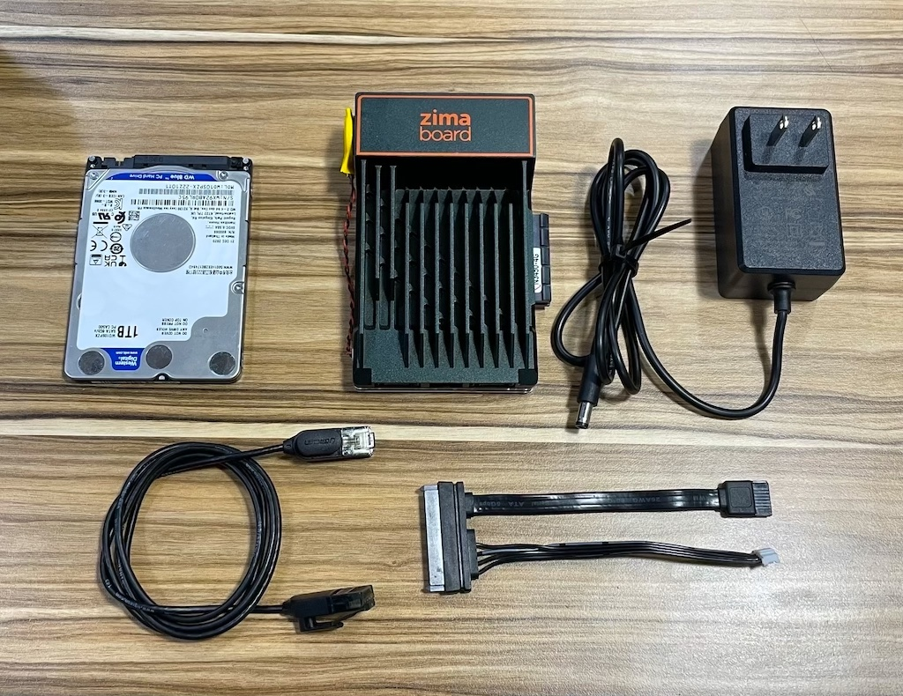

# First Look at Home Server

Whether you are an expert or a novice, the Quick Start tutorial will take you through the basic hardware specifications of the ZimaBoard, the basic applications of the pre-built home server, and some basic account permission systems for debugging and development.

With this short tutorial, you will be able to set up a brand new personal data center in your home in less than 15 minutes. Let's get started!

## Overview

- ZimaBoard Power Up
- Discovering and accessing shared folders (Samba)
- Manage your Movies and TV shows with Emby
- Manage your Photos with Lychee
- Oculus meet ZimaBoard

## Hardware Preparation

- ZimaBoard 
- 12V 3A Power Adapter
- Cat.5E or higher network cable
- SATA Cable for ZimaBoard
- 2.5" SATA SSD or HDD

:::tip
You don't need to connect your mouse and keyboard to the ZimaBoard, you can access all the services on the ZimaBoard directly through the network after connecting cables.

Of course, if you find it more convenient to plug in the display, you can also use a miniPD to HDMI cable and mouse button.
:::

## Wiring and Powering Up

1. It is recommended to connect the ZimaBoard to your router or optical cat through a network cable, refer to this picture

:::info

If you have multiple routers in your network, make sure to connect the ZimaBoard to your primary router. Or at least to the router at the same level you use to access the device.

In short, just try to connect to the top router!

Network Details

**For example, if your network looks like this:**

The routers are connected as shown in the diagram. Both router A and router B are connected to different devices that need to be networked, and you want them both to be connected to the ZimaBoard, connect the ZimaBoard to router A.

But if all your devices that need to be networked are actually connected to router B, or if you only want the devices under router B to access the ZimaBoard, then just connect to router B.

---

**The same goes for the following network situation:**

The routers are connected as shown in the figure. Routers A, B, C and D are all connected to different Internet devices, and you want them all to connect to the ZimaBoard, connect the ZimaBoard to router A.

If you only want the devices under router B to access the ZimaBoard, then just connect to router B. At this point, none of the devices connected to routers A and C will be able to access the ZimaBoard.

:::

2.  **No Power First!** the hardware wiring diagram is as follows

3. Plug in the power cable and the network indicator flashes! (ง ͡ʘ ͜ʖ ͡ʘ)ง

:::info
The network indicator blinks normally and the system is powered on normally.
Please be patient for about 10-15 seconds! 

If no external disk is connected, the system may take a little longer to boot up.
:::

The system has started, next step!
