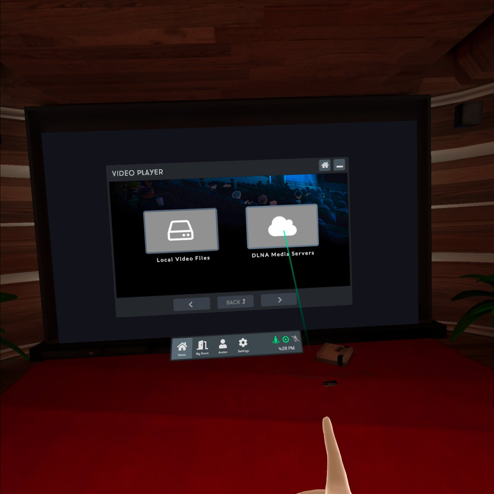

# If you're playing Oculus

## BigScreen access to DLNA server content

In addition to the basic Samba LAN service, ZimaBoard is also pre-deployed with miniDLNA service, which allows Oculus to easily access movies and content from your home server through a variety of applications via the DLNA server

In this tutorial, we use the BigScreen app on Oculus to play videos

1. Install **BigScreen** app from the Oculus Store and open it

2. Click to play the video

3. Later, Oculus scans all local DLNA servers and selects the DLNA service broadcast by ZimaBoard

4. Select your corresponding media content and enjoy it! 

With these simple steps, you can use Oculus' media player to load various movies and content from your home server! Let's stop talking for now and let me watch the movie (~˘▾˘)~

But watching 2D movies with Oculus always feels like something's not quite right, a simple tutorial for subsequent updates to VR content...

### Skybox direct access to local servers

To be written ...